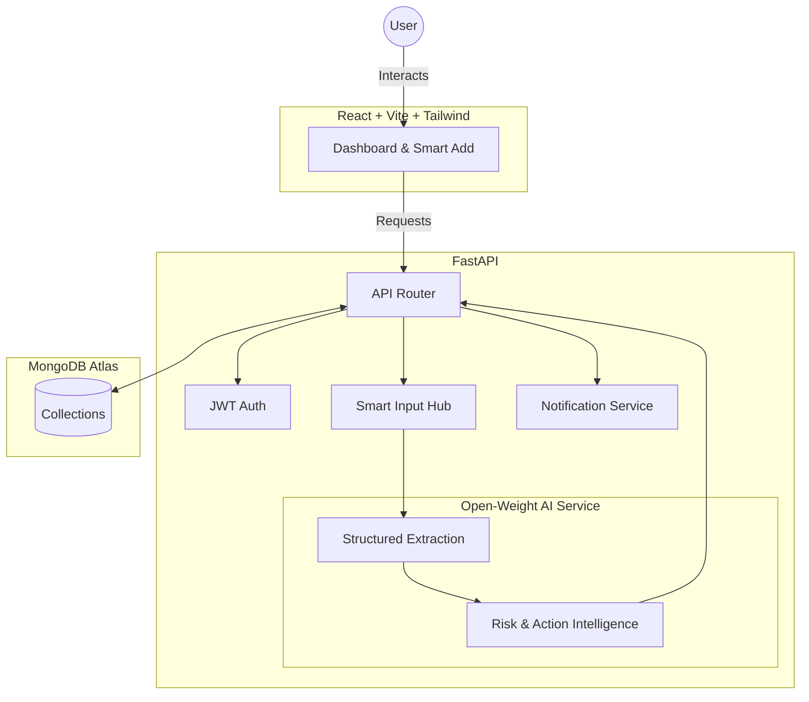

# ExpiryGuard

**An open-source AI-powered expiry intelligence system that turns everyday documents, products, warranties, subscriptions and certificates into actionable reminders before they become problems.**

---

##  Problem

Important items expire silently. From warranties and passports to subscriptions and medicines, keeping track of expiration dates is a tedious manual task. When these dates are missed, it results in financial loss, wasted products, or significant bureaucratic headaches.

##  Solution

ExpiryGuard intelligently discovers, understands, tracks, and prioritizes expiration-related information hidden inside everyday items. It automatically determines the risk of expiration and suggests recommended actions, saving users time and preventing loss.

##  Key Features

- **Expiry Intelligence**: Determines risk score and urgency based on item type and time remaining.
- **Action Recommendations & Renewals**: Dedicated tracking for active workflows, renewals, and overdue tasks.
- **Smart Add Hub**: Unified upload process through OCR, Voice, Barcode, or manual entry.
- **Natural-Language Smart Search**: Instantly query and filter inventory using natural language (e.g. "Show warranties expiring soon") powered securely by AI.
- **Specialized Dashboards**: 
  - **Needs Attention**: Prioritize critical and high-risk items.
  - **Documents**: Centralized view for warranties, certificates, licenses, and contracts.
  - **Notifications**: History of alerts and reminders with read/unread tracking.
  - **Settings**: Manage profile details, toggle notifications, and adjust email schedules.
- **Open-Weight AI Integration**: Relies on open-weight LLMs (Gemma via OpenRouter) to parse unstructured text into highly accurate JSON structures and process search queries.
- **Interactive UI**: A vibrant, modern dashboard built with React and TailwindCSS featuring a responsive sidebar navigation.
- **Automated Notifications**: Email alerts sent via a background scheduler to keep you informed.
- **User Validation Flow**: Extracted data is presented to the user for validation before saving.

##  Open-Source AI Usage

**Why open-source/open-weight AI matters:**
Traditional expiration tracking either requires manual entry or relies on black-box, proprietary AI models. By moving to an open-weight AI (specifically **Gemma**) for core extraction tasks, ExpiryGuard avoids vendor lock-in and democratizes intelligent extraction. The open-weight Gemma model is used to intelligently parse OCR outputs and voice transcripts into precise, validated JSON structures.

ExpiryGuard uses an open-weight Gemma model through hosted inference for its core AI extraction layer. Gemma converts unstructured OCR and voice-derived text into structured expiry information. The application then applies deterministic risk and action logic before saving the user-confirmed result.

*Note: The Gemma inference is hosted via an external provider (OpenRouter) and does not run locally on Render, keeping the backend extremely lightweight.*

##  Architecture & Data Flow



##  Tech Stack

- **Frontend**: React, Vite, TailwindCSS, Chart.js, Lucide-React
- **Backend**: Python, FastAPI, Uvicorn, Sentry SDK
- **Database**: MongoDB (Atlas)
- **AI/ML**: Google's open-weight **Gemma** model (e.g., `google/gemma-4-26b-a4b-it`) hosted via inference providers (OpenRouter)
- **External Services**: OCR.space, Brevo (Emails), Open Food Facts (Barcodes)

##  Environment Variables

Copy `.env.example` to `.env` or set the following in your environment:

```env
MONGODB_URL=your-mongodb-connection-string
JWT_SECRET=your-random-jwt-secret-key
EMAIL_USER=your-verified-sender@domain.com
BREVO_API_KEY=your-brevo-api-key
FRONTEND_URL=http://localhost:5173

# Open-Source AI Config (Example using OpenRouter)
OPEN_MODEL_API_KEY=your_openrouter_api_key
OPEN_MODEL_BASE_URL=https://openrouter.ai/api/v1
OPEN_MODEL_NAME=google/gemma-4-26b-a4b-it

# Optional
OCR_SPACE_API_KEY=your-ocr-space-api-key
SENTRY_DSN=your-sentry-dsn
```

##  Local Setup

### 1. Backend

```bash
cd backend
python -m venv venv
# Windows: venv\Scripts\activate | Mac/Linux: source venv/bin/activate
pip install -r requirements.txt
uvicorn app:app --reload
```
Runs at `http://localhost:8000`.

### 2. Frontend

```bash
cd frontend
npm install
npm run dev
```
Runs at `http://localhost:5173`.

##  Render Deployment & API Limitations

ExpiryGuard is strictly designed to remain deployable on Render's free tier.
- **Frontend**: Deploy as a static site using `npm run build`.
- **Backend**: Deploy as a Web Service.
  - Build Command: `pip install -r requirements.txt`
  - Start Command: `uvicorn app:app --host 0.0.0.0 --port $PORT`
  - Ensure all environment variables are added to the Render dashboard.
  - *No GPU, Docker, or heavy localized models required.*

**Hosted Inference Considerations:**
- Render hosting can use the applicable free-tier configuration.
- The selected Gemma inference provider (OpenRouter) is currently offering the `google/gemma-4-26b-a4b-it` endpoint at $0/token pricing. However, this is subject to the provider's rate limits, availability, and pricing changes. We do not guarantee API access will be permanently free or unlimited.
- The application architecture completely avoids requiring GPU infrastructure on Render by offloading the inference to the provider.

##  Future Improvements
- Deeper integration of Temporal for robust cron scheduling.
- Advanced Tabular ML prediction for risk behavior once sufficient data is gathered.
- Multi-language Voice support.
